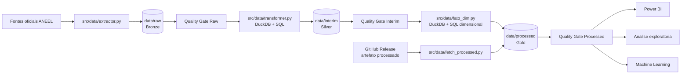

# Arquitetura do Projeto

## Visão geral

O projeto implementa um pipeline ELT local para transformar dados publicos da ANEEL em tabelas analíticas no formato *Parquet*. O processamento é executado pelo Python e DuckDB através de pipeline local na raiz do projeto (`main.py`)

## Diagrama da arquitetura

## Fluxo operacional

O ponto de execução é `main.py`, que executa as etapas na seguinte ordem:

1. `run_extract_data()` baixa os dados oficiais da ANEEL para `data/raw` (Camada Bronze).
2. `validate_raw_tables()` verifica arquivos e estrutura mínima dos dados extraídos.
3. `run_transform_data()` aplica os filtros SQL e grava os Parquets em `data/interim` (Camada Silver).
4. `validate_interim_tables()` verifica tipos, período, nulos, duplicidades e integridade.
5. `run_fato_dim()` cria o Star Schema em `data/processed` (Camada Gold).
6. `validate_processed_tables()` verifica manifesto, chaves e regras da camada Gold.

Se uma etapa falhar, o pipeline é interrompido para evitar que dados inválidos avancem para a camada seguinte.

## Camadas de dados

### Bronze: `data/raw`
Contém os arquivos obtidos diretamente das fontes da ANEEL. Os dados ainda não estão no modelo dimensional e passam por validação antes da transformação.

### Silver: `data/interim`
Contém os dados tratados pelos arquivos `src/sql/filter_*.sql`. Nesta camada são aplicados padronização de nomes e tipos, normalização de CNPJ e textos, conversão de datas e números, recorte do período de 2021 a 2025 e seleção dos campos necessários ao modelo.

### Gold: `data/processed`
Contém as dimensões, os fatos e o arquivo `_manifesto.json` gerados pela modelagem dimensional. Essa camada é destinada ao consumo analítico.

## Principais componentes

### `main.py`
Coordena a execução local do fluxo completo.

### `src/data/extractor.py`
Baixa os dados oficiais da ANEEL, prepara as pastas das camadas de dados e gera o manifesto da camada Bronze.

### `src/data/transformer.py`
Executa as transformações com DuckDB usando os arquivos SQL de filtro, exporta os resultados em Parquet e gera o manifesto da camada Silver.

### `src/data/fato_dim.py`
Cria as dimensões e fatos do Star Schema e gera o manifesto da camada Gold.

### Módulos de Qualidade

- `src/data/quality_raw.py`: valida a camada Bronze;
- `src/data/quality_interim.py`: valida a camada Silver;
- `src/data/quality_processed.py`: valida a camada Gold.

### `src/sql/`
Contém os filtros das camadas intermediárias e as consultas de dimensões e fatos.

### `src/utils/`
Contém utilitários de download, leitura de SQL, codificação de CSV, formatação de tempo e geração dos manifestos.

## Consumo dos dados

* O Power BI e os notebooks podem consumir os Parquets de `data/processed`. 

* A camada `data/interim` é a mais adequada para exploração da origem e auditoria dos tratamentos. 

* Features para Machine Learning devem ser derivadas da camada Gold, respeitando a disponibilidade temporal das informações.

* Há um caminho alternativo de obtenção dos dados: `src/data/fetch_processed.py`. Esse script baixa o artefato processado do GitHub Release diretamente para `data/processed`, sem ser necessário executar novamente todo o pipeline.

